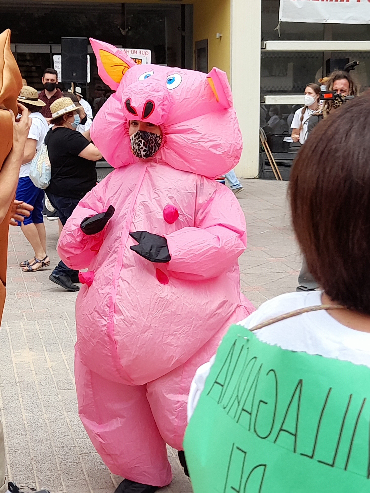

# **¡Bienvenido/a!**

Esta página web es una forma de documentar el código en el que se base el analisis cuantitativo de mi
proyecto de investigación. Está diseñada para ser usada al tiempo que se lee el artículo.

## ¿Cómo puedes utilizar esta web?

1. La página está organizada en varias pestañas. Puedes navegar por cada una de ellas según tus intereses.

2. El objetivo de esta web es hacer mi investigación reproducible y transparente. Por lo tanto, podrás
encontrar explicaciones de mi código (escrito en el lenguaje de programación R). Las explicaciones bien
son introducidas antes del código o dentro del código (en ese caso, las explicaciones están introducidas
por una almohodilla "#"). 

# Agradecimientos.

This website is based on the code generously shared by doctor Matthew Crump. 
You can find his github here.

Likewise, I would like to acknowledge several people who helped during the 
research and writing processes of the dissertation associated with this website. 
The production of knowledge is never an individual task. I am grateful to my 
informants for being the kind co-producers of knowledge that allowed to get to 
know them and their struggles. I apologize in advance in case I have 
miss-interpreted any of your views.

Likewise, my own background as a social scientist means that I have not been 
trained to explore the impacts of “macrogranjas” on human and environmental 
health. To this end, I contacted members of Castilla la Mancha’s University 
(UCLM) who kindly helped me by providing me with relevant literature and 
correcting my misconceptions. I owe gratitude to Hugo, Lucía and Carmen from 
UCLM-Albacete’s Agrarian Engineering department for sending that literature 
across and chatting with me over coffee.

Similarly, the pulmonologist Jesus was of an invaluable help to understand the 
impact of industrial farming on human health. He sent me relevant papers and 
explained them to me. Likewise, I would not have been able to produce fieldwork 
without my parents. They renounced to their holidays and drove around CLM to do so.

Last, but by no means least, I would like to thank my supervisor at King’s 
College London (Doctor Pradella). She was a great role model who provided 
helpful and patient guidance throughout the whole process.

Mujer conformante de Pueblos Vivos Cuenca, disfrazada como un cerdo y bailando
jotas manchegas durante la Vendimia de la Vergüenza en Quintanar del Rey
19/06/2021
